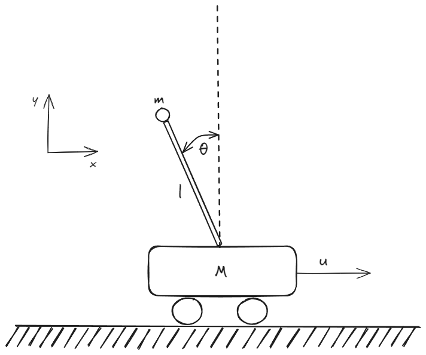
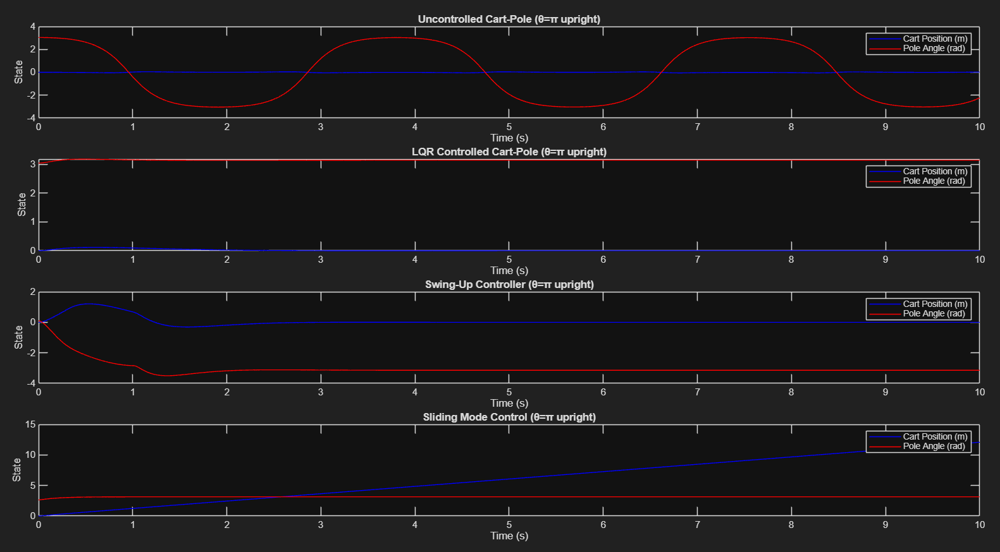
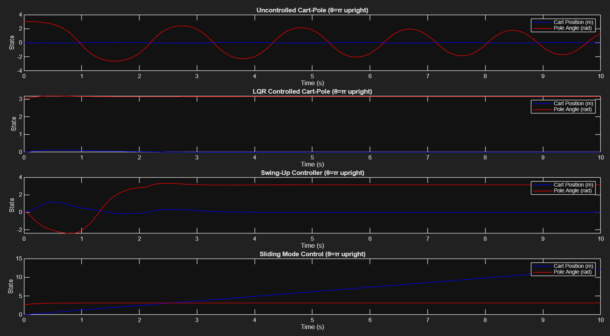
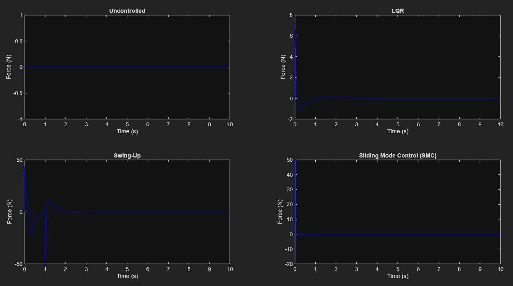
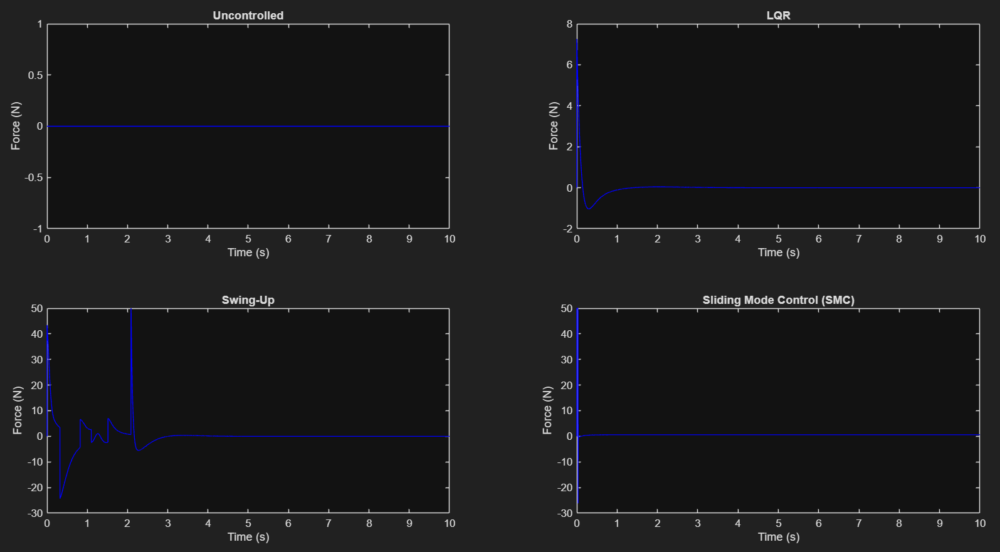

# Inverted Pendulum on a Cart — Underactuated Robotics Control

Modeling and control of the classic cart-pole system: a pendulum that can only be actuated indirectly, through a horizontal force on the cart it's mounted on. Developed as a course project on underactuated robotics, comparing a linear baseline controller against two nonlinear controllers for swinging up and stabilizing the pendulum in the upright position.

## At a glance

| | |
|---|---|
| **System** | Inverted pendulum on a cart (single control input, two degrees of freedom) |
| **Model** | Nonlinear equations of motion via Euler-Lagrange, linearized about the upright equilibrium for LQR |
| **Controllers** | Uncontrolled (baseline), LQR (linear), Energy-based swing-up (nonlinear), Sliding Mode Control (nonlinear) |
| **Simulation** | MATLAB, semi-implicit Euler integration, dt = 1 ms, T = 10 s |
| **Robustness check** | Each controller re-tested with cart/pivot friction (0.5 N·s/m and 0.03 N·m·s/rad) |

## System model



State vector **x** = [x, ẋ, θ, θ̇], with x the cart position and θ the pendulum angle from vertical (θ = π is upright). The nonlinear equations of motion are derived with the Euler-Lagrange method from the system's kinetic and potential energy, then linearized about θ = π to get the A, B matrices used for LQR design. The full derivation (Lagrangian, equations for x and θ, matrix and state-space form) is in the report.

## Controllers

- **Uncontrolled** — baseline with zero input force, included to show the pendulum's natural (unstable) behavior.
- **LQR** — linear-quadratic regulator on the dynamics linearized at the upright equilibrium; a local stabilizer that only works near θ = π.
- **Energy-based swing-up** — a nonlinear controller that pumps energy into the pendulum until it matches the energy of the upright position, then hands off to a stabilizing controller — works from the downward resting position, not just near the top.
- **Sliding Mode Control (SMC)** — defines a sliding surface `s = θ̇ + λ(θ − π)` and drives the system onto it with an equivalent + switching control law. Robust to model uncertainty near the upright position, but (as derived analytically in the report and confirmed in simulation) it only constrains the pendulum angle — the cart's residual velocity is left unregulated, so the cart drifts at constant speed once the pendulum is stabilized.

## Results

Each controller was simulated from a near-upright start for the position/angle plots, and evaluated both without and with friction on the cart and pendulum pivot.

| Without friction | With friction (0.5 N·s/m cart, 0.03 N·m·s/rad pivot) |
|---|---|
|  |  |
|  |  |

All four controllers succeed at stabilizing the pendulum at π (or −π). Each shows an initial transient of oscillating/spiking control force that settles to ~0 once stabilized; adding realistic friction doesn't change the qualitative behavior of any controller. The SMC plots show the expected cart drift discussed above — the pendulum angle locks onto π while the cart position ramps up at constant velocity.

## Repository structure

```
Underactuated Control/
├── README.md
├── assets/                                  simulation result plots + system diagram
│   ├── invertedCartPendulum.png
│   ├── allControllersPositions.png
│   ├── allControllersForces.png
│   ├── allControllersPositionsFriction.png
│   └── allControllersForcesFriction.png
├── docs/
│   ├── UnderactuatedRoboticsReport.pdf       full report (model derivation, controller design, results)
│   └── UnderactuatedRoboticsProject.excalidraw.png   working notes from the derivation process
└── matlab/
    └── cartPole2.m                          simulation: all 4 controllers, with/without friction
```

## Tools & technology

- **MATLAB** (`lqr()` for the linear controller design, custom nonlinear dynamics + semi-implicit Euler integration for simulation)
- Euler-Lagrange mechanics for the nonlinear model
- Linearization + LQR, energy-shaping (swing-up), and sliding-mode control theory

## References

1. B. D. O. Anderson and J. B. Moore, *Optimal Control: Linear Quadratic Methods*. Prentice Hall, 1989.
2. K. Åström and K. Furuta, "Swinging up a pendulum by energy control," *Automatica*, vol. 36, no. 2, pp. 287–295, 2000.
3. M. W. Spong, "The swing up control problem for underactuated mechanical systems," *Proc. 15th IFAC World Congress*, 1998.
4. J.-J. E. Slotine and W. Li, *Applied Nonlinear Control*. Prentice Hall, 1991.
5. P. Grossimon, E. Barbieri, and S. Drakunov, "Sliding mode control of an inverted pendulum," 1996.
6. P. R. Young, "Sliding-mode design for underactuated mechanical systems," *J. Dynamic Systems, Measurement, and Control*, vol. 121, no. 2, pp. 256–263, 1999.

See `docs/UnderactuatedRoboticsReport.pdf` for the full write-up, including the complete derivation and stability analysis.

## Skills demonstrated

Nonlinear dynamics modeling (Euler-Lagrange), linearization and LQR control design, energy-based nonlinear control, sliding mode control and stability analysis, numerical simulation of nonlinear systems in MATLAB.
